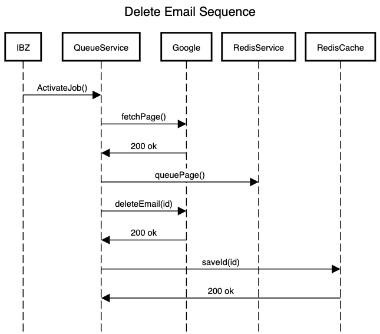
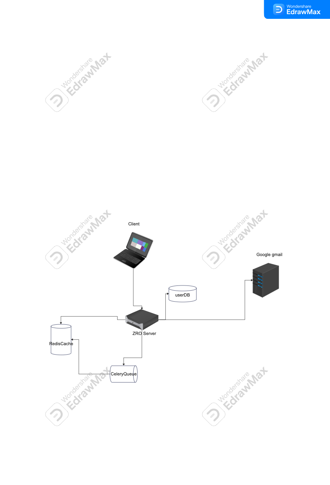

ZRO is built with the intention of stream lining the soft deletion of emails from Gmail. Built to scale the mass deletion
of unwanted emails. 

        

<h3><strong> API Contract</strong></h3>

Home#activateJob - Activate asynchronous Celery process to begin queuing emails

Queue Service/fetchPage - Call Google to get page email ids

Queue Service/queuePage - Store email ids in Redis Queue 

Queue Service/deleteEmail - Call Google to delete email 

Queue Service/saveId - Store processed email ids in Redis cache 

<h3><strong>System Diagram</strong></h3>

        

