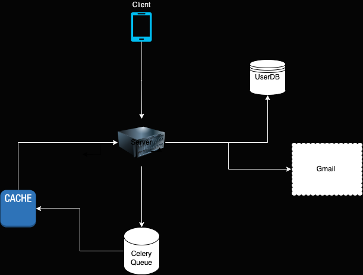

ZRO is built with the intention of stream lining the soft deletion of emails from Gmail. Built to scale the mass deletion
of unwanted emails. 
 
 
<h3><strong>System Diagram</strong></h3>

        

 
 
<h3><strong> API </strong></h3>

<em>Index.activateJob</em>: Activate asynchronous Celery process to begin queuing emails

<em>Queue Service/fetchPage</em>: Call Google to get page email ids

<em>Queue Service/queuePage</em>: Store email ids in Redis Queue 

<em>Queue Service/deleteEmail</em>: Call Google to delete email 

<em>Queue Service/saveId</em>: Store processed email ids in Redis cache 

 
 
<h3><strong> Delete Sequence </strong></h3>

        

